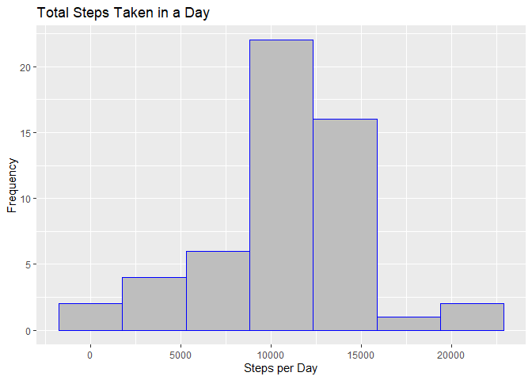
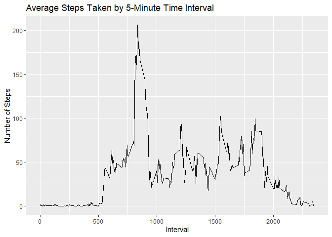
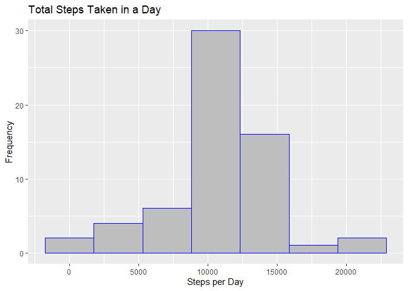
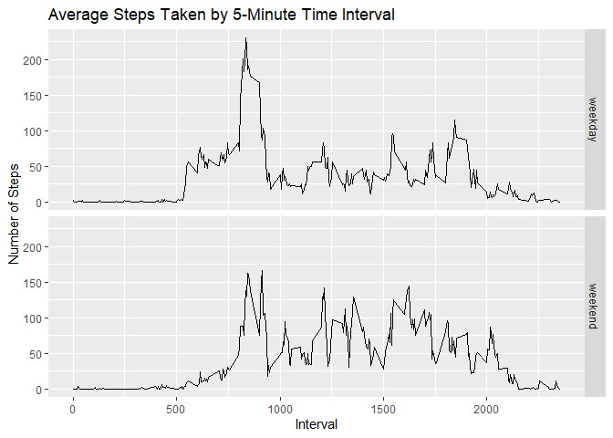

## Loading and preprocessing the data
This project started with data and files forked from here: 
[https://github.com/rdpeng/RepData_PeerAssessment1.](https://github.com/rdpeng/RepData_PeerAssessment1)  
All project code assumes these files are in the working directory.  

Below is the code to load the data and get the dates in a more usable format.  
It also loads the libraries that will be used later.


```r
## Load the libraries to be used
library(dplyr)
library(ggplot2)

## Load the data from the provided zip file and clean up the temp file.
temp_data_file <- unzip("activity.zip")
initial_data <- read.csv(temp_data_file)
file.remove(temp_data_file)

## Convert dates in the dataset to the Date class
initial_data$date <- as.Date(initial_data$date)
```

## What is mean total number of steps taken per day?
To answer this question, we start by calculating the total number of steps taken per day. We're not worrying about missing values yet.


```r
## Calculate the total number of step per day
steps_per_day <- 
        initial_data %>%
        group_by(date) %>%
        summarize(daysteps = sum(steps))
```

Now we create a histogram of the total number of steps taken each day.


```r
## Use ggplot2 to create the histogram
## Seven bars seems appropriate for the number of data points
h <- ggplot(steps_per_day, aes(x = daysteps)) +
        geom_histogram(na.rm = TRUE, bins = 7, color = "blue", fill = "grey") +
        labs(x = "Steps per Day", y = "Frequency") +
        ggtitle("Total Steps Taken in a Day")

print(h)
```

<!-- -->

Finally, we calculate the mean (and median) total number of steps taken per day to answer the original question. We're ignoring NA values for now.


```r
## Calculate the mean
mean(steps_per_day$daysteps, na.rm = TRUE)
```

```
## [1] 10766.19
```

```r
## Calculate the median  
median(steps_per_day$daysteps, na.rm = TRUE)
```

```
## [1] 10765
```


## What is the average daily activity pattern?
To answer this question, we'll start by calculating the average number of steps across all days for each 5-minute interval.


```r
avg_per_interval <- 
        initial_data %>%
        group_by(interval) %>%
        summarize(avgsteps = mean(steps, na.rm = TRUE))
```

Then we will create a time series plot of the average number of steps across all days for each 5-minute interval in a day.


```r
## Use ggplot2 to create the plot
t <- ggplot(avg_per_interval, aes(x = interval, y = avgsteps)) +
        geom_line(na.rm = TRUE) +
        labs(x = "Interval", y = "Number of Steps") +
        ggtitle("Average Steps Taken by 5-Minute Time Interval")

print(t)
```

<!-- -->

Finally, we want to find the interval that has the greatest average number of steps across all days.


```r
avg_per_interval$interval[which.max(avg_per_interval$avgsteps)]
```

```
## [1] 835
```

## Imputing missing values

Here we calculate the total number of missing values in the dataset.


```r
sum(!complete.cases(initial_data))
```

```
## [1] 2304
```

The strategy for filling in missing values in the dataset will be to use the mean for the corresponding 5-minute interval for these reasons:  
1. This application only requires a simple method.  
2. This seems better than replacing all NAs with a single value (which is another simple method) as there is much variability across intervals.  
3. The 5-minute interval means are already calculated above.  

Here is the code to create a new dataset with each missing value filled in with its corresponding 5-minute interval mean.


```r
## Start with the original data
filled_data <- initial_data

## Loop through each row to find missing data; fill in missing values with 
## the mean of the matching 5-minute time interval
for(i in 1:nrow(filled_data)) {
        if(is.na(filled_data$steps[i])) {
                n <- which(avg_per_interval$interval == filled_data$interval[i])
                interval_avg <- avg_per_interval$avgsteps[n]
                filled_data$steps[i] <- interval_avg
        }
}
```

Now we will create a new histogram of the total number of steps taken per day.

The next code chunk calculates the total number of step per day using the new dataset.


```r
new_steps_per_day <- 
        filled_data %>%
        group_by(date) %>%
        summarize(daysteps = sum(steps))
```

Then we can create the histogram.


```r
## Use ggplot2
## Seven bars seems appropriate for the number of data points
new_h <- ggplot(new_steps_per_day, aes(x = daysteps)) +
        geom_histogram(na.rm = TRUE, bins = 7, color = "blue", fill = "grey") +
        labs(x = "Steps per Day", y = "Frequency") +
        ggtitle("Total Steps Taken in a Day")

print(new_h)
```

<!-- -->

Finally, we calculate the mean and median of the total number of steps taken per day using the new dataset.


```r
## Calculate the mean
mean(new_steps_per_day$daysteps)
```

```
## [1] 10766.19
```

```r
## Calculate the median
median(new_steps_per_day$daysteps)
```

```
## [1] 10766.19
```

We can see that adding the missing values did not change the mean from when we calculated it without those values. This makes sense since the values added were all mean values. We can also see that the median, which was already close to the mean, increased slightly to become equal to the mean.

So one impact of imputing missing data in the manner we used (interval mean) was to raise the median. From the histograms, we can also see that another impact was to increase the frequency for some numbers of steps per day (notice the y-axis scale is higher on the second histogram). A look at the data explain this -- when values are missing, they are missing for the entire day (there are no days with partial values). Because of this, the effect of imputing missing data was to **add** days of data (at mean values) rather than change the estimate of the total daily number of steps for existing days. This needs to be taken into account depending on the type of analysis being done.

## Are there differences in activity patterns between weekdays and weekends?

To answer this question, we will use the new dataset with the filled-in missing values.  
We'll start by creating a new factor variable indicating whether a given date is a weekday or a weekend.


```r
weekend_days <- c("Saturday", "Sunday")
for(i in 1:nrow(filled_data)) {
        if(weekdays(filled_data$date[i]) %in% weekend_days) {
                filled_data$daytype[i] <- "weekend"
        } else {
                filled_data$daytype[i] <- "weekday"
        }
}
```

Now we'll create a panel plot showing a time series plot of average number of steps for each 5-minute interval in a day for both weekday and weekend days.

To do this, we'll start by calculating the average number of steps for each 5-minute interval for weekday days and for weekend days using the new dataset.


```r
new_avg_per_interval <- 
        filled_data %>%
        group_by(daytype, interval) %>%
        summarize(avgsteps = mean(steps))
```

Now we can draw the panel plot.


```r
## We'll use ggplot2
new_t <- ggplot(new_avg_per_interval, aes(x = interval, y = avgsteps)) +
        facet_grid(daytype ~ .) +
        geom_line(na.rm = TRUE) +
        labs(x = "Interval", y = "Number of Steps") +
        ggtitle("Average Steps Taken by 5-Minute Time Interval")

print(new_t)
```

<!-- -->

From the plot we can see several differences in activity patterns between weekdays and weekends:  
1. There is less activity early in the day on weekends.  
2. The is less high activity on weekends.  
3. The activity on the weekends is more spread out (more peaks) than on weekdays.
